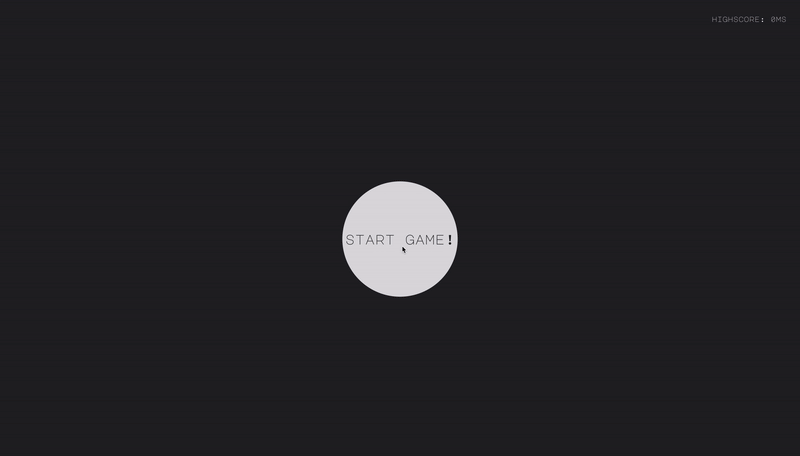

# Reaction Game in Next.JS



This project had the objective of creating a game using Javascript and React with Next.js! 

It is a simple reaction game where the player has to click on the green button as fast as he can! 

Hope you like it!

-- Rodrigo 🐥

## Local Run

Before starting the app, please make sure to install all the dependencies:
```
cd reaction-game
npm install
```
Once that's done, please run the following command to start the local server: 
```
npm run dev
```
Open [http://localhost:3000](http://localhost:3000) within your browser and enjoy! :)
